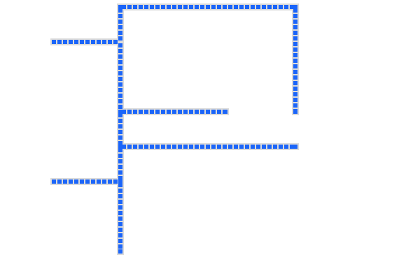

# Canvas 自动化配置管道的分支、汇流、流动动态

## 效果


## 配置文件
```js
export default [{
    // 起点坐标[X,Y]
    start: [100, 100],
    dest: [200, 100],
    branch: [{
        dest: [200, 50],
        branch: [{
            dest: [450, 50],
            branch: [{
                dest: [450, 200],
            }]
        }]
    }, {
        dest: [200, 200],
        branch: [{
            dest: [350, 200],
        }]
    }]
}, {
    start: [100, 300],
    dest: [200, 300],
    branch: [{
        dest: [200, 250],
        branch: [{
            dest: [200, 200],
        }, {
            dest: [450, 250],
        }]
    }, {
        dest: [200, 400],
    }]
}]
```

## demo基于[Parcel](https://parceljs.org/getting_started.html)

## 启动
```
parcel src/index.html
```